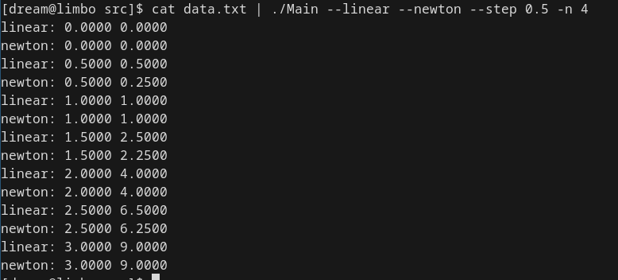
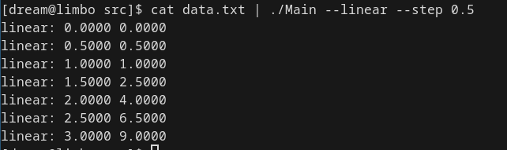
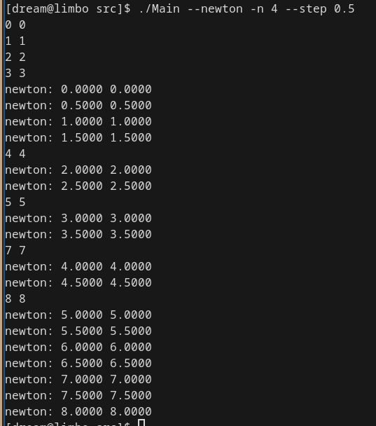
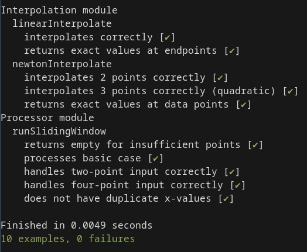

# Лабораторная работа 3
 - Выполнил: Думцев Виктор Сергеевич
 - Группа: P3312

# Реализация
 - В модуле Interpolation вся математика, включая вычисление разностей для интерполяции ньютона.
 - В Processor логика окон интерполяции и генерации иксов для интерполяции.
 - В Main логика парсинга аргументов, слияния потоков для линейной и ньютона, если они оба включены, а также вывод результата.

# Тесты

